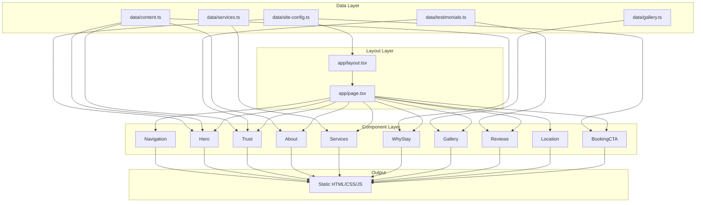
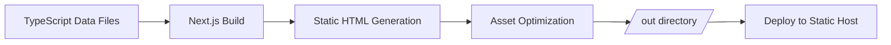

# Design Document

## Overview

CamTheBarber is a premium one-page static website built with Next.js (App Router) and Tailwind CSS. The site serves as a trust-building landing page for Cam, a high-end barber at Just Another Barbershop in West Seattle. The architecture is intentionally lightweight — a single statically-exported page composed of section components fed by local TypeScript data files.

The design philosophy prioritizes restraint, editorial warmth, and performance. No CMS, no database, no auth, no server-side logic. The entire site compiles to static HTML/CSS/JS via `next export` (output: 'export') and can be deployed to any static host.

### Key Design Decisions

| Decision | Choice | Rationale |
|----------|--------|-----------|
| Framework | Next.js 14+ (App Router) | Static export, image optimization, TypeScript, metadata API |
| Styling | Tailwind CSS | Utility-first, custom theme tokens, no runtime CSS |
| Typography | Inter + Playfair Display | Refined sans-serif body + editorial serif headings |
| Animation | CSS transitions only | No animation libraries; subtle opacity/transform transitions |
| Data | Local TypeScript objects | Simple, type-safe, no build-time data fetching |
| Images | next/image | Responsive delivery, lazy loading, priority hints |
| Deployment | Static export | No server required, under 1MB total page weight |

## Architecture

The architecture follows a simple unidirectional data flow: static TypeScript data files are imported by React components, which render semantic HTML styled with Tailwind CSS utilities.



### Static Export Pipeline



## Components and Interfaces

### File Structure

```
├── app/
│   ├── layout.tsx          # Root layout: metadata, fonts, global styles
│   ├── page.tsx            # Main page composing all sections
│   └── globals.css         # Tailwind directives + custom CSS properties
├── components/
│   ├── Navigation.tsx      # Fixed nav with scroll-aware visibility
│   ├── Hero.tsx            # Headline, subheadline, CTAs, media placeholder
│   ├── Trust.tsx           # Client loyalty narrative + review highlights
│   ├── About.tsx           # First-person about section
│   ├── Services.tsx        # Service cards with pricing
│   ├── WhyStay.tsx         # Differentiator blocks
│   ├── Gallery.tsx         # Responsive image grid
│   ├── Reviews.tsx         # Testimonial cards
│   ├── Location.tsx        # Shop info + map placeholder
│   └── BookingCTA.tsx      # Final CTA section
├── data/
│   ├── site-config.ts      # External URLs, site metadata
│   ├── services.ts         # Service listings with pricing
│   ├── testimonials.ts     # Review/testimonial content
│   ├── gallery.ts          # Gallery image references
│   └── content.ts          # Section copy (about, trust, differentiators)
├── public/
│   └── images/             # Static image assets (placeholders initially)
├── tailwind.config.ts      # Custom theme: colors, fonts, spacing
├── next.config.js          # Static export configuration
├── tsconfig.json           # TypeScript configuration
└── package.json            # Dependencies (Next.js, React, Tailwind only)
```

### Component Interfaces

```typescript
// components/Navigation.tsx
interface NavigationProps {}
// Renders fixed nav with up to 5 anchor links
// Shows on scroll (desktop), hamburger menu (mobile)
// Uses CSS scroll-behavior: smooth for anchor navigation

// components/Hero.tsx
interface HeroProps {
  headline: string;
  subheadline: string;
  bookingUrl: string;
  galleryAnchor: string;
}
// Renders hero section with headline, subheadline, 2 CTAs, media placeholder

// components/Trust.tsx
interface TrustProps {
  narrative: string;
  reviewHighlights: ReviewHighlight[];
}
interface ReviewHighlight {
  quote: string;       // min 20 characters
  attribution: string; // client name
}
// Renders narrative + 3-6 review highlights
// Conditionally hides reviews if fewer than 3 available

// components/About.tsx
interface AboutProps {
  heading: string;
  body: string;        // 50-200 words, first-person voice
}
// Renders about section with heading and body content

// components/Services.tsx
interface ServicesProps {
  services: Service[];
}
interface Service {
  name: string;        // e.g., "Premium Haircut"
  description: string; // brief description
  price: string;       // e.g., "$55"
}
// Renders service cards (max 3 visible without scroll)

// components/WhyStay.tsx
interface WhyStayProps {
  heading: string;
  differentiators: Differentiator[];
}
interface Differentiator {
  label: string;       // short label
  description: string; // max 120 characters
}
// Renders 5 differentiator blocks, single-column on mobile

// components/Gallery.tsx
interface GalleryProps {
  images: GalleryImage[];
}
interface GalleryImage {
  src: string;         // image path
  alt: string;         // descriptive alt text (1-150 chars)
  category: 'fades' | 'beard work' | 'classic cuts' | 'texture' | 'detail work';
}
// Responsive grid: 1 col mobile, 2 col tablet, 3 col desktop
// Uniform aspect ratio, lazy loading, fade-in on viewport entry

// components/Reviews.tsx
interface ReviewsProps {
  testimonials: Testimonial[];
}
interface Testimonial {
  name: string;        // first name + last initial
  quote: string;       // 20-200 characters
}
// Renders testimonial cards, all visible on 768px+ viewports

// components/Location.tsx
interface LocationProps {
  shopName: string;
  area: string;
  nearbyLandmark: string;
  parkingInfo: string; // placeholder with bracket notation
}
// Renders shop info, map placeholder (200px min height), parking info

// components/BookingCTA.tsx
interface BookingCTAProps {
  message: string;
  bookingUrl: string;
  instagramUrl: string;
}
// Renders final CTA with conditional button visibility
// Primary button: filled, opens in new tab
// Secondary button: outlined, opens in new tab
// Hides button if URL is empty
```

### Layout Component (app/layout.tsx)

```typescript
// Responsibilities:
// - Load Inter + Playfair Display via next/font
// - Set metadata via Next.js Metadata API (title, description, OG, canonical)
// - Apply global Tailwind styles
// - Wrap children in semantic <html>, <body> with ARIA landmarks
// - No client-side JavaScript beyond what Next.js requires
```

### Page Component (app/page.tsx)

```typescript
// Responsibilities:
// - Import all section components
// - Import data from data/ files
// - Compose sections in order: Hero → Trust → About → Services → WhyStay → Gallery → Reviews → Location → BookingCTA
// - Wrap in <main> with proper ARIA landmark
// - Each section wrapped in <section> with id for anchor navigation
```

## Data Models

### data/site-config.ts

```typescript
/**
 * Site-wide configuration for external URLs and metadata.
 * Update these values to change all corresponding links across the site.
 */
export const siteConfig = {
  /** External booking platform URL. Set to empty string to hide booking buttons. */
  bookingUrl: '[https://your-booking-url.com]',
  /** Instagram profile URL. Set to empty string to hide Instagram buttons. */
  instagramUrl: '[https://instagram.com/camthebarber]',
  /** Canonical URL for the site */
  canonicalUrl: '[https://camthebarber.com]',
  /** Open Graph image path (relative to public/) */
  ogImage: '/images/og-image.jpg',
  /** Site title for metadata */
  title: 'CamTheBarber | Premium Barber in West Seattle',
  /** Meta description */
  description: 'CamTheBarber offers premium haircuts, beard trims, and relationship-driven grooming in West Seattle at Just Another Barbershop.',
} as const;
```

### data/services.ts

```typescript
/**
 * Service listings displayed in the Services section.
 * Each service has a name, brief description, and starting price.
 * To update pricing, change the price string value.
 */
export interface Service {
  /** Display name of the service */
  name: string;
  /** Brief description of what's included */
  description: string;
  /** Starting price displayed as "starting at $X" */
  price: string;
}

export const services: Service[] = [
  {
    name: 'Premium Haircut',
    description: '[Precision cut tailored to your style and hair type]',
    price: '$55',
  },
  {
    name: 'Haircut + Beard',
    description: '[Full haircut with detailed beard shaping and lineup]',
    price: '$75',
  },
  {
    name: 'Beard Trim / Lineup',
    description: '[Detailed beard grooming with clean edges and shaping]',
    price: '$35',
  },
];
```

### data/testimonials.ts

```typescript
/**
 * Client testimonials displayed in Trust and Reviews sections.
 * Each testimonial includes a client name (first name + last initial)
 * and a quote between 20-200 characters.
 * At least one testimonial should reference following Cam from Capitol Hill.
 */
export interface Testimonial {
  /** Client display name (first name and last initial, e.g., "Marcus T.") */
  name: string;
  /** Quote text, 20-200 characters */
  quote: string;
  /** Optional star rating (1-5) */
  rating?: number;
}

export const testimonials: Testimonial[] = [
  {
    name: '[Client Name]',
    quote: '[I followed Cam from Capitol Hill to West Seattle — that says everything about the experience.]',
    rating: 5,
  },
  {
    name: '[Client Name]',
    quote: '[Testimonial quote here — minimum 20 characters, maximum 200 characters]',
    rating: 5,
  },
  {
    name: '[Client Name]',
    quote: '[Testimonial quote here — minimum 20 characters, maximum 200 characters]',
    rating: 5,
  },
  {
    name: '[Client Name]',
    quote: '[Testimonial quote here — minimum 20 characters, maximum 200 characters]',
  },
  {
    name: '[Client Name]',
    quote: '[Testimonial quote here — minimum 20 characters, maximum 200 characters]',
  },
];
```

### data/gallery.ts

```typescript
/**
 * Gallery image references for the Gallery section.
 * Each entry defines an image source path, alt text, and work category.
 * Images should be placed in public/images/gallery/.
 * Categories: fades, beard work, classic cuts, texture, detail work
 */
export interface GalleryImage {
  /** Path to image relative to public/ directory */
  src: string;
  /** Descriptive alt text (1-150 characters) identifying subject and purpose */
  alt: string;
  /** Work category displayed as caption */
  category: 'fades' | 'beard work' | 'classic cuts' | 'texture' | 'detail work';
}

export const galleryImages: GalleryImage[] = [
  {
    src: '/images/gallery/placeholder-1.jpg',
    alt: '[Description of haircut style and technique shown]',
    category: 'fades',
  },
  {
    src: '/images/gallery/placeholder-2.jpg',
    alt: '[Description of beard work shown]',
    category: 'beard work',
  },
  {
    src: '/images/gallery/placeholder-3.jpg',
    alt: '[Description of classic cut shown]',
    category: 'classic cuts',
  },
  {
    src: '/images/gallery/placeholder-4.jpg',
    alt: '[Description of texture work shown]',
    category: 'texture',
  },
  {
    src: '/images/gallery/placeholder-5.jpg',
    alt: '[Description of detail work shown]',
    category: 'detail work',
  },
  {
    src: '/images/gallery/placeholder-6.jpg',
    alt: '[Description of fade technique shown]',
    category: 'fades',
  },
];
```

### data/content.ts

```typescript
/**
 * Section copy content for About, Trust narrative, and Why differentiators.
 * All text content is maintained here, separate from component logic.
 * Update values directly — no component changes needed.
 */

export const heroContent = {
  /** Primary headline displayed in the hero section */
  headline: 'The barber clients followed across Seattle.',
  /** Supporting subheadline below the headline */
  subheadline: 'Premium cuts, beard work, and genuine connection — now available in West Seattle at Just Another Barbershop.',
};

export const trustContent = {
  /** Narrative paragraph referencing client loyalty and the move to West Seattle */
  narrative: '[When Cam moved from Capitol Hill to West Seattle, his clients followed. That kind of loyalty isn\'t built on haircuts alone — it\'s built on trust, consistency, and the kind of genuine connection that makes every visit feel personal.]',
};

export const aboutContent = {
  /** Section heading */
  heading: 'About Cam',
  /** First-person body copy, 50-200 words. Must reference at least 2 of: genuine conversation, consistency of service, attention to craft, making clients feel personally known. No CTAs, discounts, or price references. */
  body: '[I believe the best haircuts happen when you actually know the person in the chair. Over the years, I\'ve built my practice around genuine conversation and consistency — showing up the same way every time, paying attention to the details that matter to you specifically. My craft isn\'t just about technique; it\'s about making you feel personally known the moment you sit down. Every client gets my full attention, every visit.]',
};

export const whyContent = {
  /** Section heading */
  heading: 'Why Clients Stay',
  /** Five differentiators, each with a short label and description (max 120 chars) */
  differentiators: [
    {
      label: 'Consistent Results',
      description: '[You get the same quality and attention every single visit — no guessing, no off days.]',
    },
    {
      label: 'Detail-Oriented Grooming',
      description: '[Every line, every blend, every edge gets the focus it deserves.]',
    },
    {
      label: 'Relaxed Real Conversation',
      description: '[No forced small talk — just genuine connection that makes the experience feel easy.]',
    },
    {
      label: 'Premium Experience',
      description: '[From the environment to the finish, everything is intentional and elevated.]',
    },
    {
      label: 'Long-Term Barber Relationship',
      description: '[A barber who remembers your preferences, your life, and what works for you.]',
    },
  ],
};

export const locationContent = {
  /** Shop name */
  shopName: 'Just Another Barbershop',
  /** Area description */
  area: 'West Seattle, Seattle, WA',
  /** Nearby landmark reference */
  nearbyLandmark: 'near Alaska Junction',
  /** Parking info placeholder */
  parkingInfo: '[Parking and access details here]',
};

export const bookingContent = {
  /** CTA message */
  message: 'Cam is now accepting appointments in West Seattle.',
};
```

## Error Handling

### Conditional Rendering

Since this is a static site with local data, runtime errors are minimal. The primary error handling involves graceful degradation of content:

| Scenario | Handling |
|----------|----------|
| Fewer than 3 testimonials in data | Trust section hides the reviews portion entirely (Req 2.4) |
| Empty booking URL | BookingCTA hides the "Book with Cam" button (Req 9.5) |
| Empty Instagram URL | BookingCTA hides the "Follow on Instagram" button (Req 9.5) |
| Missing gallery image | next/image displays placeholder background color |
| Invalid image path | next/image onError handler shows fallback color block |

### Build-Time Validation

TypeScript interfaces enforce data shape at build time:
- Services must have name, description, and price fields
- Testimonials must have name and quote fields
- Gallery images must have src, alt, and a valid category enum value
- Site config URLs are typed as strings (empty string = hidden)

### Image Loading

- Hero image: `priority` prop ensures it loads immediately (no layout shift)
- Gallery images: `loading="lazy"` defers below-fold images
- All images use `placeholder="empty"` with a solid background color container to prevent CLS
- `onError` callback on next/image renders a neutral color block fallback

### Accessibility Error Prevention

- All interactive elements receive proper `aria-label` or visible text
- Focus management uses native browser behavior (no custom focus trapping)
- Color contrast validated against WCAG 2.1 AA at design time via Tailwind config

## Testing Strategy

### Why Property-Based Testing Does Not Apply

This feature is a static one-page website with:
- No complex business logic, parsers, or data transformations
- No algorithms with large input spaces
- Primarily UI rendering, layout, and content display concerns
- Simple conditional rendering (show/hide based on data presence)

The acceptance criteria are overwhelmingly about visual presentation, responsive layout, content structure, and brand aesthetics — none of which benefit from property-based testing. Testing is best served by example-based unit tests, integration tests, and visual/accessibility audits.

### Testing Approach

#### Unit Tests (Vitest + React Testing Library)

Test individual components render correctly given their props:

- **Hero**: Renders headline, subheadline, both CTAs, media placeholder
- **Trust**: Renders narrative, conditionally renders reviews (≥3 required)
- **About**: Renders heading and body content
- **Services**: Renders all 3 services with names and prices
- **WhyStay**: Renders 5 differentiators with labels and descriptions
- **Gallery**: Renders correct number of images with captions and alt text
- **Reviews**: Renders testimonials with names and quotes
- **Location**: Renders shop name, area, landmark, map placeholder, parking info
- **BookingCTA**: Renders/hides buttons based on URL presence, correct link targets
- **Navigation**: Renders anchor links, correct href values

#### Integration Tests

- Full page renders all sections in correct order
- Anchor navigation links point to correct section IDs
- External links open in new tabs (`target="_blank"`, `rel="noopener noreferrer"`)
- Metadata renders correctly (title, description, OG tags, canonical)

#### Accessibility Tests (jest-axe)

- Each section passes automated axe accessibility checks
- Heading hierarchy is sequential (h1 → h2 → h3, no skips)
- All images have appropriate alt text
- Interactive elements have sufficient touch targets
- Color contrast meets WCAG 2.1 AA minimums

#### Visual/Layout Tests

- Responsive layout snapshots at 375px, 768px, and 1280px breakpoints
- Gallery grid columns: 1 (mobile), 2 (tablet), 3 (desktop)
- No horizontal overflow at any breakpoint
- Whitespace ratios maintained per section

#### Performance Validation

- Lighthouse CI in GitHub Actions targeting:
  - LCP < 2.5s
  - CLS < 0.1
  - INP < 200ms
- Bundle size check: total page weight < 1MB
- Image optimization: all images served via next/image pipeline

#### Build Verification

- `next build` completes without errors
- Static export generates valid HTML
- All TypeScript types pass strict checking
- No unused exports or dead code (via ESLint)

### Test Configuration

```
Testing Framework: Vitest
Component Testing: @testing-library/react
Accessibility: jest-axe
Performance: Lighthouse CI
Linting: ESLint + eslint-plugin-jsx-a11y
Type Checking: TypeScript strict mode
```

### Test Organization

```
├── __tests__/
│   ├── components/
│   │   ├── Hero.test.tsx
│   │   ├── Trust.test.tsx
│   │   ├── About.test.tsx
│   │   ├── Services.test.tsx
│   │   ├── WhyStay.test.tsx
│   │   ├── Gallery.test.tsx
│   │   ├── Reviews.test.tsx
│   │   ├── Location.test.tsx
│   │   ├── BookingCTA.test.tsx
│   │   └── Navigation.test.tsx
│   ├── integration/
│   │   ├── page.test.tsx
│   │   └── metadata.test.tsx
│   └── accessibility/
│       └── a11y.test.tsx
```
